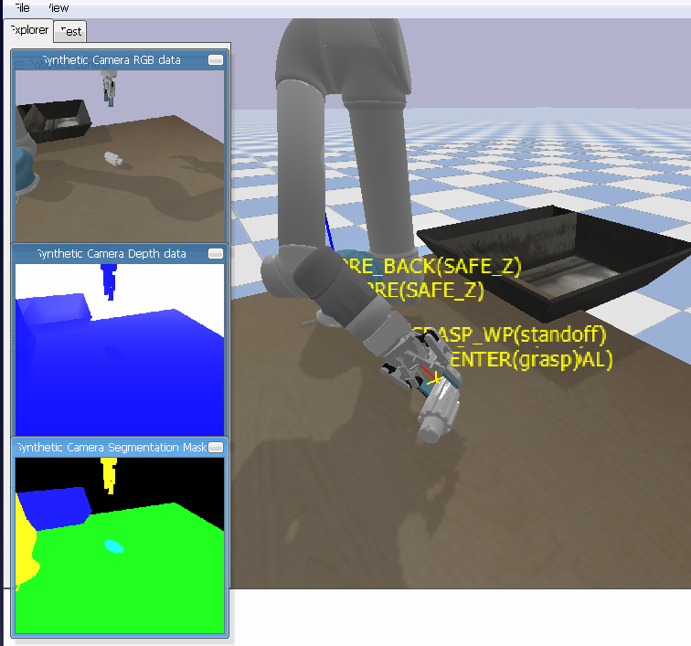

# UR5 Grasp Pipeline в PyBullet

Проект содержит исследовательский пайплайн захвата для манипулятора **UR5** с захватом **Robotiq 2F-85** в среде **PyBullet**. Репозиторий предназначен для воспроизводимых экспериментов по генерации захватов, проверке force-closure, выполнению pick-and-place и сравнению стратегий выбора захвата.

Поддерживаются три режима выбора захвата:
- `nofc` — базовый антиподальный генератор без force-closure фильтрации
- `eps` — выбор захвата по `ε`-метрике Ferrari-Canny
- `hybrid` — гибридный режим, сочетающий `nofc` и `ε`-оценку

## Демонстрация



<video src="media/grasp.mp4" controls width="900"></video>

## Что есть в репозитории

- [pick_pipeline.py](/home/dood/ur5_grasp_object_pybullet/pick_pipeline.py) — основной сценарий эксперимента
- [force_closure_module.py](/home/dood/ur5_grasp_object_pybullet/force_closure_module.py) — вычисление force-closure и `ε`-метрики
- [close_nofc.py](/home/dood/ur5_grasp_object_pybullet/close_nofc.py) — генератор базовых grasp-кандидатов
- `utils/` — утилиты для камеры, облаков точек, движения, логирования и робота
- `tools/` — скрипты анализа логов, построения таблиц и графиков
- [make_poses.py](/home/dood/ur5_grasp_object_pybullet/make_poses.py) — генерация фиксированного набора поз
- [poses.json](/home/dood/ur5_grasp_object_pybullet/poses.json) — набор поз объекта для воспроизводимых экспериментов
- `meshes/part/` — тестовые CAD-объекты
- `urdf/` — модель UR5 + Robotiq

## Структура эксперимента

Одна попытка включает:
- установку объекта в заранее заданную позу
- захват depth/point cloud
- генерацию кандидатов захвата
- фильтрацию и ранжирование кандидатов
- выполнение захвата, подъёма и укладки в корзину
- запись полной строки в `grasp_attempts.jsonl`

В логах сохраняются:
- успех/неуспех пайплайна
- причина отказа
- временные метрики
- параметры выбранного захвата
- значения force-closure
- peak RAM и число вычислений `ε`-метрики

## Установка

### 1. Создание окружения

```bash
conda env create -f graspit_env.yml
conda activate graspit
```

### 2. Подключение `pybullet-planning`

Если пакет не установлен как модуль, добавь репозиторий в `PYTHONPATH`:

```bash
export PYTHONPATH=$PYTHONPATH:/home/dood/ur5_grasp_object_pybullet/pybullet-planning
```

При необходимости можно установить локально:

```bash
pip install -e ./pybullet-planning
```

## Быстрый запуск

Запуск одного эксперимента:

```bash
python3 pick_pipeline.py --mode hybrid --mesh part_1
```

Запуск без визуализации:

```bash
python3 pick_pipeline.py --no_gui --mode nofc --mesh part_1 --max_attempts 100 --top_k 200
```

Продолжение прерванного эксперимента:

```bash
python3 pick_pipeline.py --no_gui --mode hybrid --mesh part_1 --max_attempts 1000 --top_k 200 --out_root logs_v5 --resume
```

## Доступные объекты

В репозитории используются меши:
- `part_1`
- `part_2`
- `part_4`
- `part_5`

Они выбираются через аргумент `--mesh`.

## Доступные режимы

- `nofc`
- `eps`
- `hybrid`

Пример:

```bash
python3 pick_pipeline.py --no_gui --mode eps --mesh part_4 --max_attempts 100 --top_k 200 --out_root logs_v5
```

## Воспроизводимые эксперименты

Для корректного сравнения методов используется фиксированный список поз объекта из [poses.json](/home/dood/ur5_grasp_object_pybullet/poses.json). Это позволяет запускать разные методы на одном и том же наборе положений.

Если нужен новый набор:

```bash
python3 make_poses.py
```

## Анализ результатов

### 1. Сводка по качеству

```bash
python3 tools/compare_logs.py --logs_dir logs_v5 --parts part_1,part_2,part_4,part_5 --modes nofc eps hybrid
```

### 2. Парное сравнение по одинаковым `pose_idx`

```bash
for p in part_1 part_2 part_4 part_5; do
  python3 compare_methods.py --logs_root logs_v5 --object $p
done
```

### 3. Сравнение только на тех позах, где все методы нашли захват

```bash
for p in part_1 part_2 part_4 part_5; do
  python3 tools/compare_found_only.py --logs_root logs_v5 --object $p --modes nofc eps hybrid
done
```

### 4. Временные метрики

```bash
python3 tools/plot_time_comparison.py \
  --parts part_1,part_2,part_4,part_5 \
  --root_nofc logs_v5 \
  --root_eps logs_v5 \
  --root_hybrid logs_v5 \
  --metrics synthesis \
  --out_dir paper_time_v5
```

### 5. Ресурсоёмкость

```bash
python3 tools/plot_resource_comparison.py \
  --logs_root logs_v5 \
  --parts part_1,part_2,part_4,part_5 \
  --out_dir paper_resource_v5
```

## Формат логов

Каждая попытка записывается в:

```text
logs/<object>/<mode>/grasp_attempts.jsonl
```

или в другой каталог, если указан `--out_root`.

Внутри строки JSON фиксируются:
- `pose_idx`
- `pipeline_ok`
- `task_success`
- `fail_reason`
- `fc_ok`, `fc_eps`
- `extra.perf.t_grasp_synthesis_s`
- `extra.perf.peak_ram_mb`
- `extra.perf.n_eps_metric_calls`

## Основные сценарии использования

### Сбор данных для статьи

```bash
python3 pick_pipeline.py --no_gui --mode nofc   --mesh part_1 --max_attempts 100 --top_k 200 --out_root logs_v5
python3 pick_pipeline.py --no_gui --mode eps    --mesh part_1 --max_attempts 100 --top_k 200 --out_root logs_v5
python3 pick_pipeline.py --no_gui --mode hybrid --mesh part_1 --max_attempts 100 --top_k 200 --out_root logs_v5
```

### Мониторинг долгого запуска

```bash
python3 live_monitor.py --log logs_v5/part_1/hybrid/grasp_attempts.jsonl
```

## Зависимости

Основные зависимости уже описаны в [graspit_env.yml](/home/dood/ur5_grasp_object_pybullet/graspit_env.yml). Среди ключевых:
- `pybullet`
- `numpy`
- `scipy`
- `scikit-learn`
- `matplotlib`
- `trimesh`
- `psutil`

## Назначение проекта

Репозиторий ориентирован на:
- исследование стратегий выбора захвата
- сравнение `nofc`, `eps` и `hybrid`
- анализ устойчивости захвата после закрытия и подъёма
- воспроизводимые численные эксперименты в PyBullet

## Примечание

Проект рассчитан в первую очередь на исследовательское использование. Если среда развёртывается на новой машине, сначала проверь:
- доступность `pybullet-planning`
- корректный `PYTHONPATH`
- наличие окружения `graspit`

